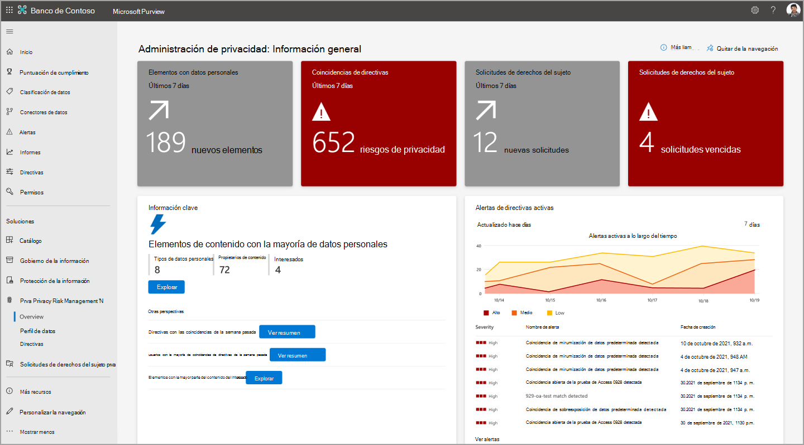

# Búsqueda y visualización de datos personales en Microsoft Priva

Microsoft Priva le ayuda a comprender los datos que almacena su organización mediante la automatización de la detección de recursos de datos personales y la visualización de información esencial. Estas visualizaciones se pueden encontrar en las páginas **de información general** y **perfil de datos** . Puede actuar sobre la información aquí para reforzar la posición de privacidad de su organización y reducir el riesgo.

Para empezar, vaya a la sección Priva del [portal de cumplimiento de Microsoft Purview](https://compliance.microsoft.com/) y vea estas páginas:

- **Información general**: proporciona una vista general de los datos de la organización en Microsoft 365. Los administradores de privacidad pueden supervisar tendencias y actividades, identificar e investigar posibles riesgos que implican datos personales, y participar en actividades clave, como la administración de directivas o las acciones de solicitud de derechos de los interesados.
- **Perfil de datos**: proporciona una instantánea de los datos personales que la organización almacena en Microsoft 365. Esta página le ayuda a visualizar dónde se encuentran los datos personales, qué tipos son los más frecuentes en su organización y cuántos tipos diferentes existen entre las ubicaciones del entorno de Microsoft 365. También puede explorar datos personales desde esta ubicación.

A medida que los datos cambian y Priva realiza nuevos hallazgos, se actualizará la información que se muestra en estas páginas. Tenga en cuenta que los nuevos datos pueden tardar hasta 24 horas en representarse en los gráficos.

## Explorar la página de información general

La página de información general consta de tres secciones principales. Los iconos de la parte superior de la página proporcionan estadísticas recientes esenciales sobre los datos. La sección de conclusiones clave proporciona oportunidades de investigación sobre tendencias y áreas de interés clave. Para obtener más perspectiva sobre el entorno de datos, consulte los gráficos de líneas de tendencia. Para obtener más información sobre estas áreas, consulte las secciones siguientes.

### Iconos principales

#### Coincidencias de directivas en los últimos 7 días

Cuando se establecen directivas en Priva Privacy Risk Management, los datos se evaluarán en función de las directivas para determinadas condiciones que podrían presentar riesgos de privacidad. Las coincidencias de directivas indican detecciones de datos que pueden necesitar revisión o corrección adicionales. En este icono se muestra cuántas coincidencias de directivas se han producido en los últimos siete días. Las coincidencias se mostrarán aquí si las directivas están activadas o en ejecución en modo de prueba, por lo que puede ver los resultados de todas las directivas activas. La selección de este icono le llevará a una vista filtrada de la página **Directivas** de Administración de riesgos de privacidad, en la que se muestran las directivas que han tenido una coincidencia en los últimos siete días.

#### Elementos con datos personales

Para ver las funcionalidades de detección automatizada de Priva en el trabajo, revise el icono **Elementos con datos personales** . Este icono muestra cuántos elementos nuevos que contienen datos personales basados en la configuración se han detectado en el entorno de Microsoft 365 de la organización en los últimos siete días. Al seleccionar este icono, se cargará una vista de los 100 elementos más recientes detectados.

#### Solicitudes de derechos de sujeto

La página de información general incluye un icono que muestra cuántas solicitudes de derechos de asunto se han creado en los últimos siete días. Un segundo icono, si procede, muestra cuántas solicitudes han vencido en función de las fechas límite designadas y puede que necesite atención inmediata. La selección de estos iconos llevará a los usuarios con los permisos adecuados a la página de solicitud de derechos del firmante de Priva.

### Información clave

#### Elementos de contenido con los datos más personales

El contenido que contiene una gran cantidad de datos personales puede presentar un mayor riesgo de exposición. Es posible que desee revisar dichos elementos para asegurarse de que están cubiertos por una política de administración de riesgos de privacidad. Para ayudar a elevar estos elementos a su atención, la página de información general proporciona una vista de los elementos de contenido que contienen los datos más personales según su configuración. Aquí puede ver el número de tipos de datos personales únicos detectados, cuántos propietarios de contenido únicos se han identificado y cuántos interesados se han identificado según la configuración de coincidencia de datos para las solicitudes de derechos del interesado.

Seleccione **Ver resumen** para obtener una vista de resumen de los elementos encontrados. También puede elegir **Explorar** estos hallazgos para obtener una vista previa de archivos individuales. Esta vista muestra un máximo de 100 elementos. Los usuarios del grupo de roles Administración de privacidad pueden seleccionar archivos para revisar los detalles y determinar la relevancia y exportar la lista en .csv formato de referencia.

#### Directivas con más coincidencias en la última semana

Esta información muestra qué directivas han coincidido con más frecuencia en los últimos siete días, ya sea en modo "Activado" o "Pruebas". Ayuda a ilustrar el rendimiento de las directivas y los efectos del trabajo en curso a medida que los usuarios priva refinan sus comportamientos de privacidad.

Seleccione **Ver resumen** para ver un resumen de las 10 directivas principales coincidentes y los propietarios de contenido del contenido asociado. También verá cuántas notificaciones de usuario se enviaron debido a estas coincidencias de directiva y al número de acciones de usuario realizadas. Seleccione **Investigar** para ver la página Directivas en Administración de riesgos de privacidad, filtrada para mostrar las directivas desde la vista de resumen. Esta vista de investigación mostrará estadísticas para toda la duración de la directiva. Selecciónelo para ver detalles como cuándo se detectaron inicialmente elementos coincidentes.

#### Usuarios con la mayor coincidencia de directivas de la última semana

Esta información también aborda las coincidencias de las directivas en modo "Testing" o "On". Permite ver un resumen de los usuarios con la mayoría de las coincidencias de directivas de la última semana y qué directivas coinciden. Esto incluye los totales de los propietarios de contenido únicos, las notificaciones enviadas a estos usuarios y cuántas acciones se realizaron desde esas notificaciones. Al seleccionar **Investigar** , se le lleva a la página de directivas, filtrada para mostrar las directivas desde la vista de resumen. En la vista de investigación, no encontrará información del usuario, pero puede seleccionar una directiva para ver los detalles de la directiva relacionados con estas coincidencias.

#### Elementos con el contenido de la mayoría de los interesados

Esta información hace referencia a la información de la característica de coincidencia de datos en las solicitudes de derechos del interesado y muestra los elementos de contenido detectados dentro de Microsoft 365 que contienen la mayoría de los interesados. Para obtener más información sobre esa configuración, consulte [Más información sobre las solicitudes de derechos del sujeto](subject-rights-requests.md).

Estos elementos pueden ayudar a confirmar la configuración de coincidencia de datos y ayudarle a mitigar los riesgos de privacidad relacionados con estos elementos. Seleccione **Ver resumen** para obtener una vista de resumen. Seleccione **Explorar** para obtener una vista detallada de hasta 100 de estos elementos. Aquí puede obtener una vista previa de estos elementos y determinar la relevancia y exportar la lista en .csv formato.

### Gráficos de líneas de tendencia

Para obtener visualizaciones dinámicas de las tendencias que se encuentran en los datos de la organización, consulte los gráficos de líneas de tendencia. Estos gráficos se pueden filtrar por características como intervalos de tiempo, tipo de datos o ubicaciones de datos. Use las listas desplegables proporcionadas para ajustar la vista. Mantener el puntero sobre las líneas del gráfico le permitirá ver estadísticas relacionadas con ese momento específico en el tiempo.

Los resultados relacionados con las directivas incluirán datos de directivas en el modo "Testing" y "On". Si no hay ninguna directiva de un tipo determinado activa, los gráficos relacionados no mostrarán resultados.

#### Alertas de directiva activa

En esta área se muestra una instantánea de alertas activas desencadenadas por coincidencias de directivas. Con el tiempo, esta vista puede ayudarle a detectar más fácilmente anomalías, como grandes picos de volumen. Seleccione **Ver alertas** para ir a la página directivas de Privacy Risk Management, donde puede investigar más alertas y crear problemas para la corrección.

#### Datos personales encontrados en la organización

Este gráfico muestra las tendencias en cuanto a la cantidad de datos personales que coinciden con la configuración que se han detectado a lo largo del tiempo en el entorno de Microsoft 365 y dónde se encuentran. Empezará a rellenarse después de que Priva haya estado ejecutándose durante suficiente tiempo y después de que se haya encontrado contenido con datos personales en SharePoint, OneDrive, Teams o Exchange.

#### Transferencias de datos detectadas en la organización

Este gráfico está relacionado con las directivas de transferencia de datos. Proporciona una vista de cómo se mueven los datos dentro de la organización, ya sea entre departamentos o entre regiones para organizaciones multigeográficas.

#### Datos personales sin usar

Este gráfico está relacionado con las directivas de minimización de datos. Proporciona información sobre cómo su organización almacena contenido que contiene datos personales y cómo las directivas pueden mejorar el control de estos datos a lo largo del tiempo.

#### Datos personales sobreexpuestos

Este gráfico está relacionado con las directivas de sobreexposición de datos. Puede ayudarle a identificar comportamientos de uso compartido a lo largo del tiempo dentro de su organización y ubicaciones en las que el contenido con datos personales puede estar sobreexpuesta, por ejemplo, si se comparte públicamente, se comparte con un usuario externo o se comparte ampliamente dentro de la organización.

#### Solicitudes de derechos de los sujetos por reglamento

Esta vista proporciona información sobre qué regulaciones impulsan con mayor frecuencia las solicitudes de derechos de los sujetos a lo largo del tiempo. La leyenda de este gráfico muestra los nombres de las normativas de tendencias. Al mantener el puntero sobre las líneas de tendencia, se mostrarán los totales de solicitudes de derechos de sujeto abiertas para esa regulación durante el tiempo seleccionado.

#### Solicitudes de derechos de sujeto por estado

En este gráfico se muestra cómo está haciendo su organización con la finalización de solicitudes de derechos del firmante, divididas en solicitudes que están **activas**, **cerradas** o **vencidas**. Los resultados aquí pueden ayudar a indicar dónde podría beneficiarse de la asignación de más recursos para cerrar las solicitudes y los objetivos de reunión.

### Vistas de datos adicionales

#### Solicitudes de derechos del sujeto de un vistazo

Esta vista proporciona una vista de alto nivel de las solicitudes de derechos de los sujetos activos, incluido el tiempo restante para completar las solicitudes según sus fechas límite. Resume cuántas solicitudes totales tiene, cuántas están activas y cuántas están cerradas. Seleccione **Ver todas las solicitudes** para ir a la página de solicitud de derechos del asunto, donde puede ver más detalles y trabajar en las solicitudes activas para avanzarlas hasta la finalización.

#### Solicitudes de derechos del sujeto por residencia

Esta vista de mapa le ayuda a visualizar el volumen de solicitudes de derechos del interesado por la residencia de los interesados. Al mantener el puntero sobre una burbuja se identificará la región y el total de solicitudes de derechos de sujeto abiertas en nombre de los residentes allí.

## Explorar la página del perfil de datos

La página de perfil de datos de Priva proporciona una vista de instantánea de los datos personales que su organización almacena en Microsoft 365 y dónde residen. También proporciona información sobre los tipos de datos que se almacenan. Los iconos principales incluyen lo siguiente.

### Instancias de tipo de datos personales detectadas en Microsoft 365

Este icono le ayuda a visualizar la cantidad de datos personales que existen en el entorno de Microsoft 365 en función de la configuración y cómo se distribuyen entre Exchange, OneDrive, SharePoint y Teams.

El gráfico de barras muestra el recuento agregado aproximado de instancias de tipo de datos personales únicas que se encuentran en el contenido. Algunos ejemplos de tipos de datos pueden incluir elementos como números de tarjeta de crédito y números de seguro social. Por lo tanto, un archivo detectado que contiene tres números de tarjeta de crédito y un número de seguro social contendrá dos tipos de datos personales únicos y cuatro instancias. La parte inferior de este icono muestra los tipos de datos personales únicos dentro de cada ubicación Microsoft 365. Proporciona una vista de la diversidad de tipos de datos personales detectados en el contenido de la organización.

### Principales tipos de datos personales en toda la organización

Este icono proporciona una instantánea de los principales tipos de datos personales detectados en su entorno, junto con información sobre cuántos elementos contienen ese tipo de datos personales y en qué ubicaciones.

### Instancias de tipo de datos personales por región

Para entornos multigeográficos, este icono agrega regionalmente instancias de tipo de datos personales que se encuentran en el contenido, en función de las regiones en las que se hospeda este contenido. En el caso de las organizaciones de una sola región, este icono mostrará un punto que representa la ubicación Microsoft 365. Al mantener el puntero sobre los puntos del mapa se mostrará el recuento aproximado de instancias de tipo de datos personales detectadas en esa región.

### Exploración del contenido

Al seleccionar **Explorar** en cualquier icono de perfil de datos, se abrirá el explorador de contenido. En este momento, no puede buscar un elemento de contenido específico y no verá Teams datos en esta vista. Esto significa que es posible que los números del explorador de contenido no coincidan con los números que se muestran en la página del perfil de datos, ya que la página del perfil de datos incluye Teams contenido. Los administradores de privacidad que quieran obtener más información sobre sus datos de privacidad pueden hacerlo aquí en función del tipo de datos personales (tipo de información confidencial) o por ubicación (Exchange, OneDrive o SharePoint).

## Declinación de responsabilidades legal

[Declinación de responsabilidades legal de Microsoft Priva](priva-disclaimer.md)
